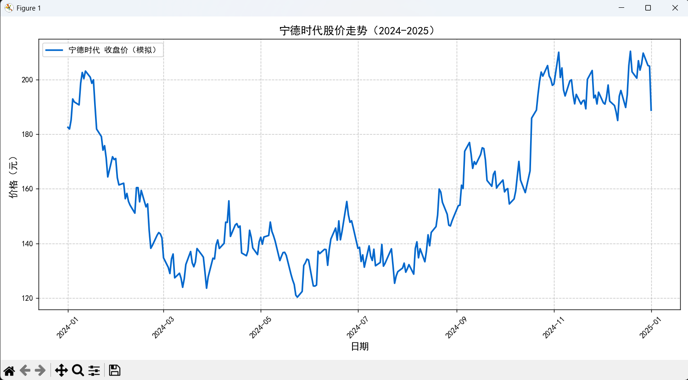

# 📈 金融股价时间序列模拟与可视化 (Financial Time Series Simulation)

## 📌 项目简介
本项目基于金融数学中的**带漂移项随机游走模型（Random Walk with Drift）**，利用 Python 进行了股价走势的数值模拟实验。

## 🛠️ 技术栈
* **数据矩阵构建**：`Numpy`, `Pandas`
* **数据可视化**：`Matplotlib` (已处理中文字体兼容问题)
* **核心算法**：利用正态分布噪声累积和（`cumsum`）模拟金融市场的马尔可夫随机波动。

## 📊 运行结果展示
 
